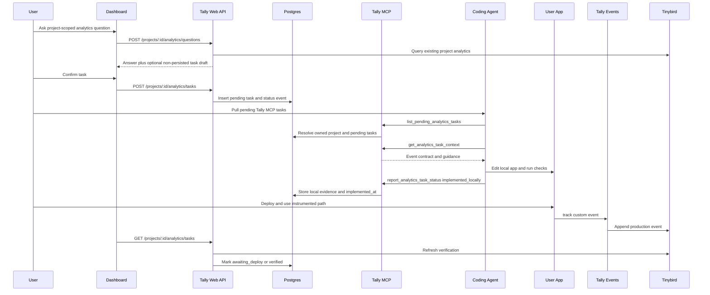

# Feature Technical Spec: Dashboard-Created Pending Analytics Tasks

Status: Planned technical direction. This does not supersede the active workstream in `plans/PLAN_STATUS.md`.

## Existing Code Analysis

### Similar Functionality Audit

**Similar functionality found**

- `apps/web/app/(dashboard)/projects/[id]/page.tsx`: Existing project detail surface with React Query state, quota copy, waiting-for-first-event copy, and regenerate actions. Add the Ask Tally panel and task queue here first.
- `apps/web/app/(dashboard)/projects/[id]/layout.tsx`: Existing project-scoped dashboard navigation. The task queue should remain project-scoped and should not introduce a global assistant route in v1.
- `apps/web/lib/hooks/use-project.ts` and `apps/web/lib/hooks/use-projects.ts`: Existing dashboard data-fetch pattern. Add task and question hooks using the same `fetch` plus `extractErrorMessage` pattern.
- `apps/web/app/api/projects/[id]/route.ts`: Existing authenticated project ownership pattern using `getUserFromRequest`, `projects.id`, and `projects.userId`. Reuse this ownership boundary for question and task APIs.
- `apps/web/app/api/projects/[id]/analytics/{overview,live,sessions}/route.ts`: Existing analytics read paths. The answer service should use the same Tinybird/E2E fixture split instead of creating a second analytics data source.
- `apps/web/lib/analytics/e2e-fixtures.ts`: Deterministic local analytics fixture loader. It currently accepts only `page_view` and `session_start`; this feature needs generic event names and explicit production/test environment markers for verification fixtures.
- `apps/web/scripts/seed-e2e-scenario.mjs`: Existing seeded user/project/event scenario harness. Extend it for pending task records and answer-flow scenarios.
- `apps/web/lib/mcp/server.ts`: Current MCP tool registration point. Register task tools here without changing the `/api/mcp` route contract.
- `apps/web/lib/mcp/tools/prepare-nextjs-install-patch.ts`: Current MCP tool implementation pattern. Task tools should use `structuredContent`, compact text `content`, Zod input schemas, and defensive auth extraction in the same style.
- `apps/web/lib/mcp/tools/schemas.ts`: Current shared MCP input schema location. Add task/project resolution schemas here or in a sibling task schema module.
- `apps/web/lib/oauth/validation.ts` and `apps/web/lib/oauth/metadata.ts`: Current OAuth model exposes only `mcp:install`. Task read/write tools need an explicit task scope so existing install-only tokens do not silently gain broader authority.
- `apps/web/lib/db/queries/projects.ts`: Existing MCP project fingerprint logic. Reuse `normalizeGitRemote`, `buildMcpProjectFingerprintInput`, and `mcpFingerprint` for task project resolution.
- `apps/web/lib/db/schema.ts`: Existing Drizzle schema and ownership model. Add task tables here with additive migrations.
- `apps/events/app/v1/track/route.ts`: Current event ingestion route. It validates only `page_view` and `session_start`, so v1 pending tasks cannot be verified against custom events until ingestion accepts custom event names and properties.
- `packages/sdk/src/core.ts`, `packages/sdk/src/tracker.ts`, and `packages/sdk/src/types.ts`: Current SDK exposes `trackPageView`, `init`, and `identify`, but no public custom `track` API. `track_completion`, `track_click`, and `add_event_property` require a small custom tracking API.
- `tinybird/datasources/events.datasource`: Warehouse schema stores `event_type` as `LowCardinality(String)`, which can support custom event names after the ingest route and SDK stop restricting the event type.

Recommendation: hybrid approach. Reuse the dashboard, auth, MCP, project fingerprint, fixture, and SDK patterns, but add a dedicated pending-task domain and an additive custom-event/property path. Do not bolt the feature onto regenerate requests or GitHub PR state; the product requirement is MCP/local-agent driven and GitHub-App independent.

### Pattern Compliance

**Existing patterns**

- File organization: API routes live under `apps/web/app/api/**/route.ts`; reusable domain logic lives under `apps/web/lib/**`; MCP tools live under `apps/web/lib/mcp/tools`; dashboard components live under `apps/web/components/**`; SDK code lives under `packages/sdk/src/**`.
- Naming: route segments and files use kebab case, TypeScript functions use camelCase, MCP tool names use snake_case, and SQL columns use lower snake case.
- Validation: Zod is used for route and MCP input validation. User-correctable failures should return typed result statuses, not raw thrown errors.
- Auth: dashboard APIs use session cookies through `getUserFromRequest`; MCP tools get the authenticated user from `extra.authInfo.extra.userId`.
- Database access: Drizzle table definitions live in `schema.ts`; query helpers live under `apps/web/lib/db/queries/*` when behavior is shared.
- Testing: Vitest route/tool tests mock dependencies directly. Dashboard UI tests render static markup with React Query. Scenario/E2E tests use checked-in JSON fixtures and seeded local DB rows.
- E2E safety: scenario seeders refuse non-local databases unless `E2E_ALLOW_REMOTE_SEED=1`.

### Integration Point Map

| File                                                             | Risk   | Coverage                                  | Notes                                                                                                     |
| ---------------------------------------------------------------- | ------ | ----------------------------------------- | --------------------------------------------------------------------------------------------------------- |
| `apps/web/lib/db/schema.ts`                                      | High   | schema/migration tests                    | Add `analytics_tasks` and `analytics_task_status_events`. Migration must be additive.                     |
| `apps/web/drizzle/migrations/*`                                  | High   | migration journal tests                   | Generate and review SQL. Preserve existing project rows.                                                  |
| `tinybird/datasources/events.datasource`                         | High   | Tinybird staging check plus fixture tests | Add `environment` and `event_properties` columns. Tinybird additions are non-reversible.                  |
| `apps/events/app/v1/track/route.ts`                              | High   | event route tests                         | Accept custom event names, environment, and bounded event properties.                                     |
| `packages/sdk/src/core.ts`, `tracker.ts`, `types.ts`, `index.ts` | High   | SDK tests plus gzip check                 | Add public `track` API while keeping SDK under 3KB gzipped.                                               |
| `apps/web/lib/analytics/e2e-fixtures.ts`                         | Medium | `e2e-analytics-fixtures.test.ts`          | Accept generic events, properties, and environment; existing overview/session semantics must stay stable. |
| `apps/web/scripts/seed-e2e-scenario.mjs`                         | Medium | `e2e-scenarios.test.ts`                   | Seed task records and fixture production events for verification scenarios.                               |
| `apps/web/app/api/projects/[id]/analytics/questions/route.ts`    | Medium | new route tests                           | Ask Tally entrypoint. Must be answer-first and never persist a task before confirmation.                  |
| `apps/web/app/api/projects/[id]/analytics/tasks/**/route.ts`     | Medium | new route tests                           | Confirm, list, edit/cancel/archive/delete pending tasks.                                                  |
| `apps/web/lib/analytics/tasks/**`                                | Medium | unit tests                                | Own question interpretation, duplicate detection, task transitions, and production verification.          |
| `apps/web/components/dashboard/analytics-tasks/**`               | Medium | page/component tests plus browser E2E     | Ask panel, draft confirmation panel, queue, edit/delete/archive controls.                                 |
| `apps/web/lib/hooks/use-analytics-tasks.ts`                      | Low    | UI tests                                  | React Query wrapper for question/task APIs.                                                               |
| `apps/web/lib/mcp/server.ts`                                     | Medium | `mcp-route.test.ts`                       | Register task tools without changing existing install tool behavior.                                      |
| `apps/web/lib/mcp/tools/analytics-tasks.ts`                      | Medium | MCP tool tests and harness                | List/context/status reporting. Must enforce authenticated ownership.                                      |
| `apps/web/lib/oauth/validation.ts`, `metadata.ts`                | High   | OAuth and MCP auth tests                  | Add an explicit task scope and preserve install-tool compatibility.                                       |
| `apps/web/lib/db/queries/projects.ts`                            | Medium | `mcp-project-queries.test.ts`             | Add owned project resolution helper for explicit project ID or MCP fingerprint context.                   |
| `plans/PLAN_STATUS.md`                                           | Low    | manual review                             | Update row metadata only. Do not change primary active workstream.                                        |

### Codebase Maturity Assessment

This is a brownfield feature in a young but structured codebase. The project has good local testing primitives, but there are three important gaps to solve in the technical design:

- Analytics ingestion and the SDK currently support only page/session events even though the product requirement needs custom events and custom properties.
- Dashboard analytics routes are direct route-level implementations. The task answer service should share behavior with those routes where possible, but some new task-specific query helpers are unavoidable.
- There is no existing durable task lifecycle table. `regenerate_requests` is not a fit because it is GitHub-PR oriented and does not preserve the answer, event contract, local agent evidence, and production verification state required here.

No blocking product decision remains. The spec assumes prompt-first/HITL behavior from the feature spec: Tally can answer or draft, but the task is not queued until the user confirms.

## Technical Decisions

### Decision 1: Non-Persistent Drafts In V1

Do not persist unconfirmed task drafts in v1. The question API returns an answer and optional draft payload to the browser. The confirm API persists the task only after explicit user action.

Rationale: this is the simplest way to honor always-HITL creation. It also makes dismiss/delete draft behavior simple: the draft disappears from the page state and is never returned by MCP.

Implications:

- `POST /api/projects/[id]/analytics/questions` never writes `analytics_tasks`.
- `POST /api/projects/[id]/analytics/tasks` is the first durable write and requires the edited draft payload.
- The UI can label the pre-confirm action as `Dismiss` or `Delete draft`; both clear local state.
- Duplicate detection still runs before showing the draft and again during confirmation to prevent race duplicates.

### Decision 2: Dedicated Task Tables With Status History

Add dedicated task tables instead of reusing project status or regenerate requests.

Rationale: the lifecycle belongs to an analytics instrumentation request, not to the project itself. The feature needs original question context, generated answer/gap, an event contract, agent evidence, duplicate prevention, and production verification timestamps.

### Decision 3: Prompt-First Answer Service With Deterministic Test Harness

Implement the dashboard question flow behind a model-ready service boundary:

```ts
interpretAnalyticsQuestion(input): Promise<AnalyticsQuestionResult>
```

The production implementation may call an LLM when that infrastructure is available, but the contract must also support deterministic classification for seeded local scenarios. Tests should assert stable result kind, task type, event name, and verification requirements, not exact prose.

Rationale: the product shape is prompt-first, but agent-run tests need repeatable behavior. A service boundary lets the app use LLM reasoning without making every unit/E2E test depend on live model output.

### Decision 4: Add Custom SDK Tracking Before Pending Tasks Ship

This feature must include the minimal custom tracking path needed for agents to implement returned tasks:

- SDK public API: `track(eventName, properties?)`
- ingest route: custom event names, bounded event properties, and environment
- Tinybird datasource: columns for event properties and environment
- fixture parser: generic event types and production/test markers

Rationale: without this path, `track_completion`, `track_click`, and `add_event_property` tasks could be queued and pulled through MCP, but agents would have no first-class Tally API to implement them and Tally could not verify them deterministically.

### Decision 5: Production Verification Is Derived, Not Agent-Reported

Agents can report `in_progress`, `implemented_locally`, or `failed`. Agents cannot report `awaiting_deploy` or `verified`.

Tally derives:

- `awaiting_deploy`: task has local implementation evidence, but no matching production event/property appears after `implemented_at`.
- `verified`: matching production event/property appears after `implemented_at`.

For v1, verification refreshes opportunistically when task list/context endpoints are called and when the project dashboard loads. A later cron can call the same `refreshAnalyticsTaskVerification` service, but no new worker is required for v1.

### Decision 6: Project Resolution Must Reuse MCP Fingerprints

MCP task tools should resolve projects using:

1. explicit `projectId`
2. exact MCP fingerprint from normalized git remote plus `appRoot`
3. exact MCP fingerprint from repo/package name plus `appRoot`
4. ambiguity response with owned candidates

Never return all pending tasks across a user's projects when repo context is missing or ambiguous.

### Decision 7: Add A Dedicated MCP Task Scope

Use the existing `/api/mcp` route, but add a separate OAuth scope for task tools:

```ts
export const MCP_INSTALL_SCOPE = 'mcp:install';
export const MCP_TASKS_SCOPE = 'mcp:tasks';
```

Authorization behavior:

- The MCP route auth layer should accept tokens with any supported MCP scope and leave per-tool scope checks to tool handlers or shared tool middleware.
- `prepare_nextjs_install_patch` continues to require `mcp:install`.
- `list_pending_analytics_tasks`, `get_analytics_task_context`, and `report_analytics_task_status` require `mcp:tasks`.
- New setup/OAuth copy should request both scopes when a user wants install plus task execution.
- Existing install-only tokens must receive an insufficient-scope tool result for task tools rather than silently gaining task read/write authority.
- `normalizeOAuthScope`, token persistence, metadata, and MCP auth tests must support a space-delimited scope set while preserving existing single-scope install tokens.

Rationale: pending task tools expose analytics intent and accept agent status/evidence. That is broader than generating an install patch, so the permission boundary should be explicit even though the transport route stays shared.

## Architecture



## Data Model

### `analytics_tasks`

Add `analytics_tasks` to `apps/web/lib/db/schema.ts`.

Recommended fields:

| Column                       | Type           | Notes                                                                                            |
| ---------------------------- | -------------- | ------------------------------------------------------------------------------------------------ |
| `id`                         | `varchar(24)`  | `task_` plus base64url random suffix.                                                            |
| `project_id`                 | `varchar(20)`  | FK to `projects.id`, cascade delete with project.                                                |
| `user_id`                    | `uuid`         | FK to `users.id`; duplicate ownership guard and faster user filtering.                           |
| `status`                     | `varchar(40)`  | Check enum listed below.                                                                         |
| `task_type`                  | `varchar(40)`  | `track_completion`, `track_click`, `add_event_property`.                                         |
| `title`                      | `varchar(180)` | User-editable before confirmation.                                                               |
| `original_question`          | `text`         | Exact user question.                                                                             |
| `answer_kind`                | `varchar(40)`  | `answered`, `partial_answer`, `cannot_answer_yet`, `unsupported`. Persisted for confirmed tasks. |
| `answer_summary`             | `text`         | Human-readable answer/gap summary at creation time.                                              |
| `analytics_gap`              | `text`         | Missing signal the task exists to close.                                                         |
| `event_name`                 | `varchar(100)` | Canonical event name to implement.                                                               |
| `trigger_description`        | `text`         | When the event should fire.                                                                      |
| `properties_schema`          | `jsonb`        | Required/optional property contract.                                                             |
| `target_surface`             | `text`         | Optional route/component/user-surface hint.                                                      |
| `implementation_guidance`    | `text`         | Agent-facing implementation guidance.                                                            |
| `verification_criteria`      | `jsonb`        | Local and production verification criteria.                                                      |
| `verification_source`        | `varchar(40)`  | `production_event` for v1 persisted tasks.                                                       |
| `duplicate_fingerprint`      | `varchar(64)`  | Hash of normalized task intent.                                                                  |
| `duplicate_of_task_id`       | `varchar(24)`  | Nullable self-reference when task is marked duplicate.                                           |
| `local_verification`         | `jsonb`        | Agent-submitted commands, changed files, and local evidence.                                     |
| `implementation_fingerprint` | `varchar(64)`  | Optional agent hash for idempotent repeated status reports.                                      |
| `last_error`                 | `text`         | Latest agent failure or verification explanation.                                                |
| `confirmed_at`               | `timestamp`    | Set when persisted.                                                                              |
| `claimed_at`                 | `timestamp`    | First `in_progress` report.                                                                      |
| `implemented_at`             | `timestamp`    | First accepted `implemented_locally` report.                                                     |
| `verified_at`                | `timestamp`    | Production verification time.                                                                    |
| `cancelled_at`               | `timestamp`    | User cancellation time.                                                                          |
| `archived_at`                | `timestamp`    | User archive time.                                                                               |
| `created_at`                 | `timestamp`    | Default now.                                                                                     |
| `updated_at`                 | `timestamp`    | Updated on every mutation.                                                                       |

Status enum:

```ts
type AnalyticsTaskStatus =
  | 'pending'
  | 'in_progress'
  | 'implemented_locally'
  | 'awaiting_deploy'
  | 'verified'
  | 'failed'
  | 'cancelled'
  | 'archived'
  | 'duplicate';
```

Task type enum:

```ts
type AnalyticsTaskType = 'track_completion' | 'track_click' | 'add_event_property';
```

Indexes and constraints:

- index `(user_id, project_id, status)`
- index `(project_id, status, updated_at)`
- index `(project_id, event_name)`
- index `(project_id, duplicate_fingerprint)`
- partial unique index on `(project_id, duplicate_fingerprint)` where `duplicate_fingerprint is not null` and `status in ('pending','in_progress','implemented_locally','awaiting_deploy','verified')`
- check `status in (...)`
- check `task_type in (...)`
- check `answer_kind in ('answered','partial_answer','cannot_answer_yet','unsupported')`

Duplicate behavior:

- Before confirmation, search active tasks by duplicate fingerprint. Return the existing task in the question response instead of showing a new confirmable draft.
- During confirmation, insert with the partial unique constraint and recover conflicts by selecting the existing task.
- If a task is intentionally persisted as a duplicate, set `status = 'duplicate'` and `duplicate_of_task_id`, but v1 should usually show the existing task and avoid inserting a duplicate row.

### `analytics_task_status_events`

Add an append-only status history table for auditability and debugging.

Recommended fields:

| Column        | Type          | Notes                                                 |
| ------------- | ------------- | ----------------------------------------------------- |
| `id`          | `varchar(28)` | `taskevt_` plus random suffix.                        |
| `task_id`     | `varchar(24)` | FK to `analytics_tasks.id`, cascade delete with task. |
| `project_id`  | `varchar(20)` | Denormalized for project-scoped audit queries.        |
| `user_id`     | `uuid`        | Owner id.                                             |
| `actor_type`  | `varchar(20)` | `user`, `agent`, or `tally`.                          |
| `from_status` | `varchar(40)` | Nullable for creation.                                |
| `to_status`   | `varchar(40)` | Required.                                             |
| `note`        | `text`        | Optional sanitized note.                              |
| `evidence`    | `jsonb`       | Sanitized status evidence.                            |
| `created_at`  | `timestamp`   | Default now.                                          |

## Event Schema And SDK Changes

### SDK API

Add a public custom tracking function:

```ts
export type EventProperties = Record<string, string | number | boolean | null>;

export async function track(eventName: string, properties?: EventProperties): Promise<void>;
```

Behavior:

- No-op unless `init` has run and tracking is enabled.
- Reuse the current session id, identified user id, URL, referrer, visitor id, and UTM context where available.
- Validate event names client-side with the same conservative rule as the ingest route: lower snake case, 1 to 100 chars, starts with a letter.
- Serialize properties into `event_properties` as JSON string.
- Bound serialized properties to 8KB. If exceeded, drop the event in debug mode with a warning and silently no-op otherwise.
- Export `track` from `packages/sdk/src/index.ts`.
- Add SDK tests for success, invalid names, DNT, no-init behavior, and property serialization.
- Measure bundle size before and after:

```bash
pnpm --filter sdk build
gzip -c packages/sdk/dist/index.js | wc -c
```

The SDK must remain under 3072 bytes gzipped.

### Ingestion Route

Update `apps/events/app/v1/track/route.ts`:

- Change `event_type` validation from fixed enum to lower-snake-case custom event names, preserving `page_view` and `session_start`.
- Accept optional `event_properties` string generated by the SDK.
- Accept optional `environment` with values `production`, `development`, or `test`.
- Default missing `environment` to `production` for backward compatibility.
- Reject or drop events with invalid names, invalid environments, or oversized properties.
- Preserve project status validation and local E2E fixture sink behavior.

### Tinybird Datasource

Add columns to `tinybird/datasources/events.datasource` and apply in staging before production:

```text
environment LowCardinality(String) `json:$.environment`
event_properties String `json:$.event_properties`
```

Verification queries must treat missing or empty `environment` as `production` for pre-migration rows:

```sql
coalesce(nullIf(environment, ''), 'production') = 'production'
```

Tinybird column additions are non-reversible. Implementation must document the exact `tb datasource alter` commands in a script or migration note before production application.

### E2E Fixture Parser

Update `apps/web/lib/analytics/e2e-fixtures.ts`:

- Accept `event_type` as any valid non-empty string.
- Parse `environment`, defaulting missing values to `production`.
- Parse `event_properties` as JSON when present, but keep the raw string for query parity.
- Keep existing overview/session/live behavior unchanged for `page_view` and `session_start`.

## Dashboard APIs

### `POST /api/projects/[id]/analytics/questions`

Purpose: answer the user's question and optionally return a non-persisted task draft.

Request:

```ts
type AskAnalyticsQuestionRequest = {
  question: string;
  period?: '24h' | '7d' | '30d';
};
```

Response:

```ts
type AskAnalyticsQuestionResponse =
  | {
      kind: 'answered';
      answer: {
        summary: string;
        metrics: Array<{ label: string; value: string | number }>;
        window: { period: string; start: string; end: string };
      };
      draft: null;
      existingTask: null;
    }
  | {
      kind: 'partial_answer' | 'cannot_answer_yet';
      answer: { summary: string; limitation: string };
      draft: AnalyticsTaskDraft;
      existingTask: null;
    }
  | {
      kind: 'partial_answer' | 'cannot_answer_yet';
      answer: { summary: string; limitation: string };
      draft: null;
      existingTask: AnalyticsTaskSummary;
    }
  | {
      kind: 'unsupported';
      answer: { summary: string; narrowingPrompt?: string };
      draft: null;
      existingTask: null;
    };
```

Rules:

- Require authenticated dashboard user and owned project.
- Trim and bound questions to 1 to 500 chars.
- Return `unsupported` for broad requests such as "track everything users do".
- Never persist a task.
- Query existing analytics through shared service helpers.
- Use stable deterministic mappings for seeded scenario questions.
- Run duplicate fingerprint lookup before returning a new draft.

### `GET /api/projects/[id]/analytics/tasks`

Purpose: list project task queue for dashboard.

Rules:

- Require authenticated owner.
- Call `refreshAnalyticsTaskVerification({ projectId, userId })` before returning active tasks.
- Return active statuses by default: `pending`, `in_progress`, `implemented_locally`, `awaiting_deploy`, `failed`.
- Include `verified`, `cancelled`, and `archived` only when `includeHistory=1`.

### `POST /api/projects/[id]/analytics/tasks`

Purpose: confirm a draft and persist a pending task.

Request:

```ts
type ConfirmAnalyticsTaskRequest = {
  draft: AnalyticsTaskDraft;
  edits?: {
    title?: string;
    eventName?: string;
    implementationNotes?: string;
  };
};
```

Rules:

- Require authenticated owner.
- Revalidate task type, event name, properties, and duplicate fingerprint server-side.
- Insert `analytics_tasks.status = 'pending'`.
- Insert an `analytics_task_status_events` row with `actor_type = 'user'`.
- If duplicate insert conflicts, return the existing task instead of creating another.

### `PATCH /api/projects/[id]/analytics/tasks/[taskId]`

Purpose: user edit, cancel, reopen, or archive from dashboard.

Allowed user actions:

- edit pending title/event/implementation notes before agent start
- cancel pending, in-progress, implemented, awaiting-deploy, or failed tasks
- archive any confirmed task
- reopen failed tasks to pending

Do not let users edit the event contract after `in_progress`.

### `DELETE /api/projects/[id]/analytics/tasks/[taskId]`

Purpose: user-facing delete action.

Behavior:

- For `pending`, set `cancelled` and hide from active queue. The UI can say "Deleted" because it is no longer returned by default.
- For non-pending confirmed tasks, return `409` with guidance to cancel or archive.
- For non-persisted drafts, no API call is required.

This preserves history and duplicate-prevention evidence while meeting the requirement that users can remove unwanted pending work from the queue.

## Task Domain Services

Create a task domain under `apps/web/lib/analytics/tasks/`:

- `types.ts`: task status, task type, answer result, draft, event contract, verification types.
- `ids.ts`: task/status-event id generation.
- `fingerprint.ts`: normalized duplicate fingerprint creation.
- `question.ts`: prompt-first question interpretation and deterministic scenario mappings.
- `queries.ts`: Drizzle reads/writes and ownership-guarded task lookup.
- `transitions.ts`: status transition rules and idempotent update handling.
- `verification.ts`: Tinybird/E2E production event verification.
- `mcp.ts`: MCP-facing project resolution and task result adapters.

### Status Transition Rules

Implement transitions in one service:

```ts
transitionAnalyticsTask({
  taskId,
  userId,
  actorType,
  toStatus,
  evidence,
});
```

Allowed transitions:

| From                         | To                    | Actor |
| ---------------------------- | --------------------- | ----- |
| generated draft              | `pending`             | user  |
| `pending`                    | `in_progress`         | agent |
| `pending`                    | `cancelled`           | user  |
| `in_progress`                | `implemented_locally` | agent |
| `in_progress`                | `failed`              | agent |
| `implemented_locally`        | `awaiting_deploy`     | tally |
| `implemented_locally`        | `verified`            | tally |
| `awaiting_deploy`            | `verified`            | tally |
| `failed`                     | `pending`             | user  |
| active statuses              | `archived`            | user  |
| active non-verified statuses | `cancelled`           | user  |

Idempotency rules:

- Repeating `in_progress` on an `in_progress` task updates `updated_at` and appends no duplicate status event unless evidence changed.
- Repeating `implemented_locally` with the same `implementation_fingerprint` is accepted and does not reset `implemented_at`.
- Repeating `failed` with the same error summary is accepted and does not duplicate status events.
- Agent attempts to move backwards from `implemented_locally` to `in_progress` return the existing task unchanged with an idempotent result.

### Verification Query

For `track_completion` and `track_click`, a task is verified when a production event exists after `implemented_at`:

```sql
SELECT
  count() AS matching_events
FROM events
WHERE project_id = {projectId:String}
  AND event_type = {eventName:String}
  AND timestamp > parseDateTimeBestEffort({implementedAt:String})
  AND coalesce(nullIf(environment, ''), 'production') = 'production'
LIMIT 1
```

For `add_event_property`, a task is verified when the target event exists after `implemented_at` and all required properties are present in `event_properties`.

Required-property check:

- Parse `properties_schema` and inspect required keys only.
- Use Tinybird/ClickHouse JSON extraction against `event_properties`.
- If the event exists but required properties are missing, keep the task in `awaiting_deploy` and set `last_error` to a sanitized missing-property summary.

Source boundary:

- Production verification evidence must come from Tinybird or from E2E fixtures explicitly marked `environment = 'production'`.
- Local agent evidence is stored in `analytics_tasks.local_verification` and never counts as production verification.
- Fixture events with `environment = 'development'` or `environment = 'test'` must not mark a task verified.

## MCP Tools

Register three tools from `apps/web/lib/mcp/server.ts`:

- `list_pending_analytics_tasks`
- `get_analytics_task_context`
- `report_analytics_task_status`

Use the existing MCP route with the dedicated `mcp:tasks` OAuth scope. Do not add a new MCP endpoint.

All three task tools must reject install-only tokens with a structured insufficient-scope result.

### Shared Project Resolution Input

```ts
type AnalyticsTaskProjectResolverInput = {
  projectId?: string;
  repo?: {
    name?: string;
    packageName?: string;
    gitRemote?: string | null;
    appRoot?: string;
  };
};
```

Resolution behavior:

- If `projectId` is present, select only the authenticated user's matching project.
- If `repo` is present, build the existing MCP fingerprint input and match owned MCP projects.
- If multiple owned projects match, return `needs_project_selection` with at most 10 candidates.
- If no project matches, return `no_matching_project`.
- Missing/ambiguous context must not fall back to all user projects.

### `list_pending_analytics_tasks`

Input:

```ts
type ListPendingAnalyticsTasksInput = AnalyticsTaskProjectResolverInput & {
  includeInProgress?: boolean;
};
```

Output statuses:

- `ready`: project resolved and tasks returned.
- `no_tasks`: project resolved but no pending/in-progress tasks.
- `needs_project_selection`
- `no_matching_project`
- `unauthorized`
- `insufficient_scope`

Task rows include compact fields only: id, title, taskType, status, eventName, createdAt, dashboardUrl.

### `get_analytics_task_context`

Input:

```ts
type GetAnalyticsTaskContextInput = {
  taskId: string;
  projectId?: string;
};
```

Output includes the full structured context from the feature spec:

- original question
- current answer
- analytics gap
- event contract
- implementation guidance
- local and production verification criteria
- current status and dashboard URL

### `report_analytics_task_status`

Input:

```ts
type ReportAnalyticsTaskStatusInput = {
  taskId: string;
  status: 'in_progress' | 'implemented_locally' | 'failed';
  projectId?: string;
  changedFiles?: string[];
  verificationCommands?: Array<{ command: string; exitCode: number; summary?: string }>;
  localEventEvidence?: Array<{ eventName: string; properties?: Record<string, unknown> }>;
  implementationFingerprint?: string;
  errorSummary?: string;
};
```

Rules:

- Require authenticated owner.
- Require `mcp:tasks` authority, not only `mcp:install`.
- Validate `changedFiles` as relative paths and limit count/length.
- Sanitize command output summaries.
- Store local evidence but never mark verified from it.
- On `implemented_locally`, set `implemented_at` if absent, then immediately call verification refresh. Return `verified` if production evidence already exists, otherwise `awaiting_deploy`.

## Dashboard UI

Add components under `apps/web/components/dashboard/analytics-tasks/`:

- `ask-tally-panel.tsx`
- `analytics-question-result.tsx`
- `task-draft-card.tsx`
- `pending-task-list.tsx`
- `task-status-badge.tsx`

Add hooks:

- `apps/web/lib/hooks/use-analytics-question.ts`
- `apps/web/lib/hooks/use-analytics-tasks.ts`

UI behavior:

- Ask panel lives on the project detail page and is scoped to the current project.
- The answer appears before any task confirmation panel.
- The Add task button is disabled until the current draft validates locally.
- Users can edit title, event name, and short notes before confirmation.
- Users can dismiss/delete the draft without network persistence.
- Pending tasks show a delete action.
- In-progress, implemented, failed, awaiting-deploy, and verified tasks show cancel/archive actions rather than hard delete.
- Status copy must distinguish local implementation from production verification.

Accessibility:

- Textarea has an explicit label.
- Edit, add, dismiss/delete, cancel, and archive controls are keyboard reachable.
- Status badges have text labels, not color alone.
- Async question/task states use `aria-live="polite"` for result updates.

## Security And Privacy

- Dashboard APIs must enforce `projects.userId = session.user.id`.
- MCP tools must enforce `projects.userId = authInfo.extra.userId`.
- MCP task tools must require `mcp:tasks`; install-only tokens must not access or mutate task state.
- MCP output must never include source code, OAuth tokens, GitHub installation tokens, Tinybird tokens, billing fields, raw visitor IDs, or raw user IDs.
- Agent status reports are untrusted input. Sanitize file paths, command summaries, local event properties, and error messages.
- Do not let an MCP client create tasks in v1. Task creation remains dashboard HITL only.
- Do not expose cross-project task lists on missing repo context.

## Testing Plan

### Unit And Route Tests

Add or extend:

- `apps/web/tests/analytics-task-queries.test.ts`
- `apps/web/tests/analytics-task-transitions.test.ts`
- `apps/web/tests/analytics-task-verification.test.ts`
- `apps/web/tests/analytics-question-api.test.ts`
- `apps/web/tests/analytics-tasks-api.test.ts`
- `apps/web/tests/mcp-analytics-tasks.test.ts`
- `apps/web/tests/mcp-route.test.ts`
- `apps/web/tests/e2e-analytics-fixtures.test.ts`
- `apps/web/tests/e2e-scenarios.test.ts`
- `apps/web/tests/project-detail-page.test.ts`
- `packages/sdk/src/*.test.ts` for custom `track`

Required assertions:

- `answered` question creates no task.
- `partial_answer` and `cannot_answer_yet` return drafts but no persisted task before confirmation.
- Confirming a draft persists exactly one pending task.
- Duplicate confirmation returns the existing task.
- Pending task delete hides it from default queue.
- Non-pending delete returns conflict.
- Agent status reports are idempotent.
- Agent local event evidence does not verify a task.
- Production fixture event after `implemented_at` verifies a task.
- Production fixture event missing required properties does not verify and reports missing properties.
- Foreign users cannot read or mutate tasks by dashboard API or MCP.
- MCP ambiguity returns `needs_project_selection`.
- Install-only MCP tokens cannot list, read, or update analytics tasks.

### Scenario Fixtures

Add seeded E2E scenarios:

- `dashboard-task-question-answered`
- `dashboard-task-question-partial`
- `dashboard-task-question-cannot-answer`
- `dashboard-task-question-unsupported`
- `dashboard-task-duplicate-existing`
- `dashboard-task-agent-implemented-awaiting-deploy`
- `dashboard-task-production-verified`
- `dashboard-task-production-missing-property`
- `mcp-pending-analytics-task`
- `mcp-pending-analytics-task-ambiguous-project`

Extend the scenario schema to support:

- `analyticsTasks`
- generic `analytics.events[].event_type`
- `analytics.events[].environment`
- `analytics.events[].event_properties`

### Commands

Minimum local verification before implementation is considered complete:

```bash
pnpm --filter web test
pnpm --filter web e2e:scenarios
pnpm --filter sdk test
pnpm --filter sdk build
gzip -c packages/sdk/dist/index.js | wc -c
```

Run browser E2E for the dashboard flow after the UI is implemented:

```bash
pnpm --filter web e2e --grep @dashboard-pending-tasks
```

Run MCP harness after the task tools are implemented:

```bash
pnpm --filter web e2e:mcp-pending-tasks
```

## Rollback

- Database: additive task tables can remain unused. If rollback is required before production use, remove route/tool registration and hide dashboard UI.
- Tinybird: added columns are non-reversible. Rollback code can stop reading them, but production schema remains expanded.
- SDK: if custom `track` causes bundle or runtime problems, revert the SDK export and block task confirmation for custom-event tasks until the SDK is repaired.
- MCP: unregister task tools in `apps/web/lib/mcp/server.ts` to remove agent access without affecting MCP install tools.

## Open Decisions

None blocking.

Implementation should revisit the exact LLM provider hook when current app LLM infrastructure is confirmed. The required contract is stable either way: the dashboard question endpoint returns a typed answer result and an optional non-persisted draft, and persistence only happens after explicit user confirmation.
