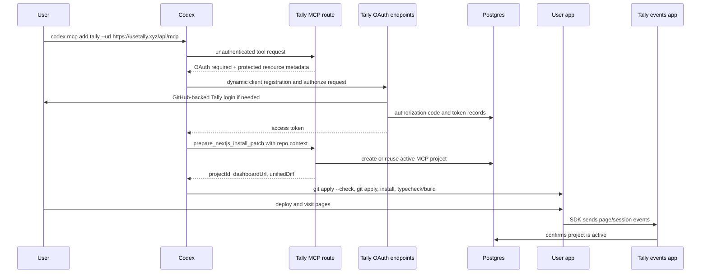

# Feature Technical Spec: MCP-First Analytics Onboarding

## Existing Code Analysis

### Similar Functionality Audit

SIMILAR FUNCTIONALITY FOUND
---------------------------

- `apps/web/lib/auth/*`: Existing GitHub OAuth, session cookie, session validation, and user lookup. Reuse this as the human login backing the Tally authorization server instead of adding a second identity system.
- `apps/web/lib/db/schema.ts`: Existing `users`, `sessions`, and `projects` ownership model. Extend this schema so projects can be created without a GitHub App installation.
- `apps/web/lib/db/queries/projects.ts`: Existing project ID generation and project status updates. Extend this with MCP project create/reuse queries.
- `apps/web/lib/github/detection.ts` and `apps/web/lib/github/detect-framework.ts`: Existing package.json, Next.js router, monorepo, and analytics dependency detection. Reuse parsing logic where it is local-context agnostic; create MCP-specific detection where current code assumes Octokit.
- `apps/web/lib/github/templates/insert-analytics.ts`: Existing insertion helpers already take component/hook names and import paths. Reuse this module for MCP patch generation after adding tests for `TallyAnalytics` and `useTallyAnalytics`.
- `apps/web/lib/github/templates/paths.ts`: Existing component path/import path helper. Generalize it to accept a basename, or create a small MCP-specific equivalent to avoid changing GitHub PR behavior accidentally.
- `apps/web/lib/github/templates/app-router.ts` and `apps/web/lib/github/templates/pages-router.ts`: Do not reuse their generated code bodies. They inline a copied tracker and explicitly avoid `@tally-analytics/sdk`; the MCP feature requires an SDK wrapper.
- `packages/sdk/src/react/app-router.tsx` and `packages/sdk/src/react/pages-router.tsx`: Existing SDK router integrations. Wrap these in generated `TallyAnalytics` and `useTallyAnalytics` files.
- `apps/web/app/(marketing)/docs/setup/page.tsx`: Existing setup docs are GitHub-App-only. Extend them with the Codex MCP path.
- `apps/web/app/(dashboard)/projects/page.tsx`: Existing empty project state is GitHub-App-only. Add MCP as a second onboarding path.
- `apps/web/app/(dashboard)/projects/[id]/*`: Existing project detail and live-feed states already support no-event projects, but copy is generic. Add the exact waiting-for-first-event state.
- `apps/events/app/v1/track/route.ts` and `apps/events/lib/project-cache.ts`: Event ingestion already validates `projects.status === "active"`. MCP-created projects must be `active` immediately so first deployed events are accepted.

Recommendation: hybrid approach. Reuse auth/session, Drizzle patterns, SDK exports, insertion helpers, tests, dashboard components, and event ingestion. Create new MCP/OAuth modules and new SDK-based patch templates because the existing GitHub PR generator is coupled to GitHub and old generated tracker code.

### Pattern Compliance

EXISTING PATTERNS
-----------------

File organization: Next.js App Router route handlers live under `apps/web/app/api/**/route.ts`; reusable server logic lives under `apps/web/lib/**`; UI components live under `apps/web/components/**`; package code lives under `packages/sdk/src/**`.

Naming convention: Kebab-case route and file names for app files, camelCase functions, explicit type exports near implementation, and Drizzle table names in lower snake case.

Error handling: API routes use `Response.json({ error }, { status })` for expected failures, catch external-service failures where a degraded response is acceptable, and avoid exposing internal errors in production-facing responses.

Testing approach: Vitest unit tests mock route dependencies directly, import route handlers, and assert JSON/status outputs. UI tests render components with `renderToStaticMarkup` and pre-seeded React Query data. E2E product states use deterministic scenario fixtures.

### Integration Point Map

| File | Risk | Coverage | Notes |
|------|------|----------|-------|
| `apps/web/package.json` | Medium | Existing scripts covered indirectly | Add `mcp-handler` and `@modelcontextprotocol/sdk`. Keep `zod` v3 already present. |
| `apps/web/lib/db/schema.ts` | High | `schema.test.ts` and migration tests | Current `projects` table requires GitHub fields. MCP projects need nullable GitHub columns plus fingerprint/source fields. |
| `apps/web/drizzle/migrations/*` | High | `migrations.test.ts` journal check | Add one additive migration and update `_journal.json`. Avoid destructive data loss. |
| `apps/web/lib/db/queries/projects.ts` | Medium | Minimal existing query tests | Add MCP create/reuse queries and expand tests beyond no-op cases. |
| `apps/web/lib/db/queries/users.ts` | Medium | Covered through OAuth callback tests | Add email-based user lookup/upsert if MCP OAuth uses existing GitHub session identity. |
| `apps/web/lib/auth/github-oauth.ts` and callback routes | Medium | OAuth helper/callback tests exist | Add safe `return_to` support so an MCP OAuth authorization request can resume after GitHub login. |
| `apps/web/app/api/oauth/*/route.ts` | High | New | Implements Tally OAuth authorization server for MCP clients. Security-sensitive. |
| `apps/web/app/.well-known/*/route.ts` | Medium | New | Required for MCP OAuth discovery. Must set CORS for metadata requests. |
| `apps/web/app/api/mcp/route.ts` | High | New | Streamable HTTP MCP endpoint and auth boundary. Use `mcp-handler` rather than manual JSON-RPC. |
| `apps/web/lib/mcp/**` | High | New | Tool registration, auth token verification, request schemas, and patch service. |
| `apps/web/lib/mcp/next-install/**` | High | New with fixture tests | Validates repo context, detects supported Next.js targets, creates/reuses project, and returns unified diff. |
| `apps/web/lib/github/templates/insert-analytics.ts` | Medium | Existing template tests | Reuse and add Tally-specific insertion tests. Avoid breaking current GitHub PR generator. |
| `apps/web/lib/github/templates/paths.ts` | Medium | Existing GitHub generate tests | Generalize carefully or create MCP-specific helper. Current basename is hardcoded to `fast-pr-analytics`. |
| `packages/sdk/src/index.ts` | Low | SDK tests exist | Prefer no SDK changes. Generated wrapper adapts existing SDK names to product names. |
| `apps/web/app/(marketing)/docs/setup/page.tsx` | Low | Marketing docs tests | Add MCP setup command and preserve GitHub App path. |
| `apps/web/app/(dashboard)/projects/page.tsx` | Low | Projects page tests | Add MCP CTA in empty state while retaining GitHub App CTA. |
| `apps/web/app/(dashboard)/projects/[id]/page.tsx` | Medium | Project detail page/API tests | Show exact pending state for active projects with no events and no PR. |
| `apps/web/app/(dashboard)/projects/[id]/live/page.tsx` | Low | Live feed page tests | Update no-events copy to exact waiting state when applicable. |
| `apps/events/lib/project-cache.ts` | Low | Existing event route tests | No code change expected if MCP projects are inserted with `status = "active"`. |

### Codebase Maturity Assessment

This is a brownfield monorepo with solid local tests and clear patterns, but the affected surface has two important constraints:

- The `projects` table is GitHub-App-coupled through non-null GitHub fields and a unique GitHub repo ID. This must be loosened carefully.
- GitHub PR generation currently uses copied tracker templates even though the SDK now exists. MCP should not extend that copied-template path.
- The SDK public names are `AnalyticsAppRouter` and `useAnalyticsPagesRouter`, while product naming requires `TallyAnalytics` and `useTallyAnalytics`. The generated wrapper should adapt names without changing the SDK public API.
- OAuth currently means "GitHub OAuth for Tally login." MCP OAuth is a separate protocol where Codex is the OAuth client and Tally is the authorization server. The implementation must keep these concepts separate.

No blocking human decision is required for v1. The spec assumes the Tally account identity remains backed by the existing GitHub login provider. Adding Google sign-in is outside this feature.

## Technical Decisions

### MCP Server Framework

| Criterion | `mcp-handler` + MCP SDK | Official SDK transport directly | Manual JSON-RPC |
|-----------|--------------------------|---------------------------------|-----------------|
| Fit with existing code | High: Next.js route handler adapter | Medium: examples are mostly lower-level server transports | Low: new protocol code |
| Implementation effort | Small/Medium | Medium/High | High |
| Risk to protocol compatibility | Low/Medium | Low if transport fits Next route handlers | High |
| Test coverage impact | Focused route/tool tests | More adapter tests | Broad protocol tests |
| Future maintainability | High | Medium | Low |
| New dependencies | 2 | 1 | 0 |

Recommendation: Use `mcp-handler` plus `@modelcontextprotocol/sdk` in `apps/web`. Confidence: high.

Rationale: The feature needs a hosted Next.js MCP endpoint. `mcp-handler` documents Next.js support, Streamable HTTP at `/api/mcp`, and an auth wrapper. It requires `@modelcontextprotocol/sdk >= 1.26.0` and `zod@^3`; this repo already uses Zod v3. The official MCP TypeScript SDK remains the underlying protocol package.

Sources:
- [mcp-handler README](https://github.com/vercel/mcp-handler)
- [mcp-handler authorization docs](https://github.com/vercel/mcp-handler/blob/main/docs/AUTHORIZATION.md)
- [MCP TypeScript SDK server docs](https://ts.sdk.modelcontextprotocol.io/documents/server.html)

### OAuth Implementation

| Criterion | Build Tally OAuth endpoints | Use OAuth gateway/proxy | API key fallback |
|-----------|-----------------------------|--------------------------|------------------|
| Fit with product spec | High | Medium | Out of scope |
| First implementation effort | Medium/High | Medium | Low |
| User experience | Best: one Tally OAuth flow | Depends on vendor | Not allowed for v1 |
| Long-term ownership | High | Medium/Low | Low |
| Security responsibility | High | Shared | High |

Recommendation: Build the OAuth endpoints in `apps/web` for v1 and use existing GitHub login as the backing user identity. Confidence: medium.

Rationale: The product only supports MCP clients where OAuth works. MCP authorization requires OAuth 2.1, protected resource metadata, and recommends dynamic client registration. Building this directly keeps account/project ownership in the existing database and avoids adding an external auth proxy before the first version is proven.

Sources:
- [MCP Authorization spec](https://modelcontextprotocol.io/specification/2025-06-18/basic/authorization)

### Patch Generation

| Criterion | Internal unified diff builder | Add diff library | Return file operations |
|-----------|-------------------------------|------------------|------------------------|
| Fit with feature spec | High | High | Low |
| Implementation effort | Medium | Small | Medium |
| Dependency risk | None | New package | None |
| Testability | High with `git apply --check` fixture tests | High | Lower for Codex compatibility |

Recommendation: Implement a narrow internal unified-diff builder for full-file replacements and new files, then validate every fixture with `git apply --check`. Confidence: medium.

Rationale: V1 changes only `package.json`, one generated wrapper file, and one entrypoint. A full-file unified diff is acceptable when the resulting file content preserves existing code except for the intended import and mount call. Avoid a new dependency until diff complexity grows.

## Architecture

The implementation stays inside `apps/web` plus tests. No new service is required.



## Dependencies

Add to `apps/web/package.json` dependencies:

```json
{
  "@modelcontextprotocol/sdk": "^1.26.0",
  "mcp-handler": "^1.1.0"
}
```

Do not add dependencies to `packages/sdk`; the generated wrapper uses the already published `@tally-analytics/sdk`.

## Data Model

### Project Schema Changes

Modify `projects` so it can represent both GitHub-App projects and MCP-created projects.

Add columns:

- `source varchar(30) not null default 'github_app'`
- `display_name varchar(255)` backfilled from `github_repo_full_name`, then made not null
- `mcp_normalized_git_remote varchar(500)`
- `mcp_repo_name varchar(255)`
- `mcp_app_root varchar(255)`
- `mcp_framework varchar(50)`
- `mcp_package_manager varchar(30)`
- `mcp_fingerprint varchar(64)`

Change existing columns:

- `github_repo_id` becomes nullable.
- `github_repo_full_name` becomes nullable.
- `github_installation_id` becomes nullable.

Keep:

- Existing project IDs, `status`, quota columns, PR columns, detection columns, and event fields.
- Existing `projects_github_repo_id_unique`; PostgreSQL allows multiple null values, so MCP projects are not blocked.

Add indexes/checks:

- `idx_projects_source` on `source`
- `idx_projects_mcp_fingerprint` on `mcp_fingerprint`
- Unique partial index on `(user_id, mcp_fingerprint)` where `mcp_fingerprint is not null`
- Check `source in ('github_app','mcp_codex')`

MCP-created projects must be inserted with:

- `source = 'mcp_codex'`
- `status = 'active'`
- `display_name = repo.name` or normalized remote owner/repo fallback
- GitHub App fields null

This preserves event ingestion behavior because `apps/events/lib/project-cache.ts` already accepts only `status === "active"`.

Project display and GitHub-action rules:

- `display_name` is the primary user-facing project name for both GitHub-App and MCP projects.
- `github_repo_full_name`, `github_repo_id`, and `github_installation_id` are nullable implementation fields. UI and API code must not require them for project list/detail rendering.
- GitHub-only actions, including regenerate/reanalyze and PR status links, are available only when `source = 'github_app'` and the required GitHub fields are non-null.
- MCP projects do not support regenerate through the GitHub analysis path in v1. If an MCP project reaches a regenerate endpoint, return `400` JSON with a message equivalent to "Regeneration is only available for GitHub App projects."

### OAuth Tables

Add these tables:

`oauth_clients`

- `client_id varchar(80) primary key`
- `client_name varchar(255)`
- `redirect_uris text[] not null`
- `grant_types text[]`
- `response_types text[]`
- `scope varchar(255)`
- `created_at timestamptz not null default now()`
- `updated_at timestamptz not null default now()`

`oauth_authorization_codes`

- `code_hash varchar(64) primary key`
- `client_id varchar(80) not null references oauth_clients(client_id) on delete cascade`
- `user_id uuid not null references users(id) on delete cascade`
- `redirect_uri varchar(500) not null`
- `code_challenge varchar(255) not null`
- `code_challenge_method varchar(20) not null`
- `scope varchar(255) not null`
- `resource varchar(500) not null`
- `expires_at timestamptz not null`
- `used_at timestamptz`
- `created_at timestamptz not null default now()`

`oauth_access_tokens`

- `token_hash varchar(64) primary key`
- `client_id varchar(80) not null references oauth_clients(client_id) on delete cascade`
- `user_id uuid not null references users(id) on delete cascade`
- `scope varchar(255) not null`
- `resource varchar(500) not null`
- `expires_at timestamptz not null`
- `revoked_at timestamptz`
- `created_at timestamptz not null default now()`

`oauth_refresh_tokens`

- `token_hash varchar(64) primary key`
- `client_id varchar(80) not null references oauth_clients(client_id) on delete cascade`
- `user_id uuid not null references users(id) on delete cascade`
- `scope varchar(255) not null`
- `resource varchar(500) not null`
- `expires_at timestamptz not null`
- `revoked_at timestamptz`
- `created_at timestamptz not null default now()`
- `rotated_from_hash varchar(64)`

Token storage rule: store only SHA-256 hashes of codes and tokens. Never log raw tokens.

### User Model

No schema change is required for users in v1. MCP OAuth uses the existing GitHub-backed Tally login. Add query helpers to find/create/update users by GitHub identity as needed; do not introduce Google in this feature.

## New Modules and Routes

### OAuth/Authorization Server

Create:

- `apps/web/lib/oauth/crypto.ts`
- `apps/web/lib/oauth/metadata.ts`
- `apps/web/lib/oauth/clients.ts`
- `apps/web/lib/oauth/codes.ts`
- `apps/web/lib/oauth/tokens.ts`
- `apps/web/lib/oauth/validation.ts`
- `apps/web/app/.well-known/oauth-protected-resource/route.ts`
- `apps/web/app/.well-known/oauth-authorization-server/route.ts`
- `apps/web/app/api/oauth/register/route.ts`
- `apps/web/app/api/oauth/authorize/route.ts`
- `apps/web/app/api/oauth/token/route.ts`

Behavior:

- `/.well-known/oauth-protected-resource` returns the MCP resource URL and authorization server issuer. Use `metadataCorsOptionsRequestHandler` or equivalent CORS handling for metadata.
- `/.well-known/oauth-authorization-server` returns RFC 8414-style metadata:
  - `issuer: https://usetally.xyz`
  - `authorization_endpoint: https://usetally.xyz/api/oauth/authorize`
  - `token_endpoint: https://usetally.xyz/api/oauth/token`
  - `registration_endpoint: https://usetally.xyz/api/oauth/register`
  - `response_types_supported: ["code"]`
  - `grant_types_supported: ["authorization_code", "refresh_token"]`
  - `code_challenge_methods_supported: ["S256"]`
  - `scopes_supported: ["mcp:install"]`
- `/api/oauth/register` accepts dynamic client registration for public clients. Validate redirect URIs as either HTTPS or localhost/127.0.0.1 loopback.
- `/api/oauth/authorize` validates client, redirect URI, resource, scope, state, and PKCE challenge. If no Tally session exists, redirect to GitHub login with a same-origin `return_to` path back to the authorize URL.
- `/api/oauth/authorize` auto-approves the `mcp:install` scope for authenticated users in v1 and redirects back with a short-lived code.
- `/api/oauth/token` supports `authorization_code` with PKCE S256 verification and `refresh_token` rotation.
- Access tokens expire after 1 hour.
- Refresh tokens expire after 30 days and rotate on every refresh.

Endpoint response contracts:

- `GET /.well-known/oauth-protected-resource` returns `200` JSON with `resource`, `authorization_servers`, and `scopes_supported`.
- `GET /.well-known/oauth-authorization-server` returns `200` JSON with `issuer`, endpoint URLs, supported grant types, supported response types, supported scopes, and supported PKCE methods.
- `OPTIONS` on both metadata routes returns CORS headers allowing metadata discovery.
- `POST /api/oauth/register` accepts JSON dynamic-client metadata:
  - `redirect_uris: string[]`
  - `client_name?: string`
  - `scope?: string`
  - `grant_types?: string[]`
  - `response_types?: string[]`
- `POST /api/oauth/register` returns `201` JSON:
  - `client_id: string`
  - `client_id_issued_at: number`
  - `redirect_uris: string[]`
  - `grant_types: ["authorization_code", "refresh_token"]`
  - `response_types: ["code"]`
  - `scope: "mcp:install"`
- `GET /api/oauth/authorize` succeeds with a `302` redirect to the registered `redirect_uri` with `code` and original `state`.
- `GET /api/oauth/authorize` returns OAuth errors by redirecting to the registered `redirect_uri` with `error` and original `state` when the redirect URI is valid. For invalid clients or invalid redirect URIs, return `400` JSON without redirecting.
- `POST /api/oauth/token` with `grant_type=authorization_code` accepts form-encoded `client_id`, `code`, `redirect_uri`, `code_verifier`, and optional `resource`.
- `POST /api/oauth/token` with `grant_type=refresh_token` accepts form-encoded `client_id`, `refresh_token`, and optional `scope`.
- Successful token responses return `200` JSON with `access_token`, `token_type: "Bearer"`, `expires_in`, `scope`, and `refresh_token`.
- Token failures return `400` or `401` JSON with OAuth-compatible `error` and optional `error_description`.

Extend existing GitHub OAuth routes:

- `/api/auth/github` accepts an optional `return_to` query param.
- Store `return_to` in an HttpOnly same-site cookie only when it is a same-origin relative path beginning with `/` and not beginning with `//`.
- `/api/auth/github/callback` redirects to the stored `return_to` after session creation, then clears the cookie. Existing default redirect remains `/projects`.

### MCP Route

Create:

- `apps/web/app/api/mcp/route.ts`
- `apps/web/lib/mcp/auth.ts`
- `apps/web/lib/mcp/server.ts`
- `apps/web/lib/mcp/tools/prepare-nextjs-install-patch.ts`

Route behavior:

- Use Node runtime.
- Create an MCP handler with `mcp-handler`.
- Register `prepare_nextjs_install_patch`.
- Wrap with MCP auth using access-token validation.
- Require scope `mcp:install`.
- Use protected resource metadata path `/.well-known/oauth-protected-resource`.
- Return OAuth-required responses for missing/invalid tokens.

Tool result behavior:

- Return structured JSON as the primary tool result.
- Also include a concise text content item that says whether the patch is ready, unsupported, needs context, or already installed. This helps MCP clients that do not fully surface structured output.

### MCP Tool Input Schema

Create Zod schemas in `apps/web/lib/mcp/tools/schemas.ts`.

The top-level shape should match `FEATURE_SPEC.md`:

- `repo.name`
- `repo.gitRemote`
- `repo.workspaceRoot`
- `repo.appRoot`
- `repo.packageManager`
- `repo.dependencyTarget`
- `framework.kind`
- `framework.entrypoint`
- `framework.usesSrcDir`
- `framework.hasAtAlias`
- `files`

Validation rules:

- `appRoot` and `dependencyTarget` must be relative paths.
- Paths must not include `..`, absolute roots, home-directory prefixes, URL schemes, or Windows drive prefixes.
- Files must satisfy the allowlist from `FEATURE_SPEC.md`.
- `framework.entrypoint` must be one of the selected Next.js entrypoint files ending in `.tsx` or `.jsx`.
- Disallow `.env*`, lockfiles, private keys, credentials, binary files, and unrelated files.
- Enforce 64 KB per file and 256 KB total request content.
- Normalize line endings to LF for patch generation.

### Next.js Install Service

Create:

- `apps/web/lib/mcp/next-install/context.ts`
- `apps/web/lib/mcp/next-install/detect.ts`
- `apps/web/lib/mcp/next-install/project-reuse.ts`
- `apps/web/lib/mcp/next-install/package-json.ts`
- `apps/web/lib/mcp/next-install/templates.ts`
- `apps/web/lib/mcp/next-install/unified-diff.ts`
- `apps/web/lib/mcp/next-install/prepare-nextjs-install-patch.ts`

Service flow:

1. Validate request and repo context boundary.
2. Determine target package JSON from `repo.dependencyTarget`.
3. Determine framework from `framework.kind` and selected entrypoint.
4. Reject unsupported frameworks, ambiguous app roots, missing package file, missing entrypoint, and conflicting existing integrations.
5. Create or reuse the MCP project for the authenticated user.
6. Infer wrapper extension from the entrypoint extension and render wrapper file content.
7. Update package JSON to add `@tally-analytics/sdk` to `dependencies`.
8. Insert wrapper import and mount call into the entrypoint.
9. Generate unified diff from submitted originals to generated outputs.
10. Return `ready` with `projectId`, dashboard URL, `patchFormat`, `unifiedDiff`, `filesChanged`, `packageInstallCommand`, and verification list.

### Project Reuse Implementation

Normalize git remotes:

- Convert `git@github.com:owner/repo.git` and `https://github.com/owner/repo.git` to `github.com/owner/repo`.
- Lowercase host and owner/repo.
- Strip trailing `.git`.
- Preserve non-GitHub hosts as `host/path` if parseable.

The database uniqueness key is `mcp_fingerprint`. It is the authoritative reuse key and must mirror the feature matching rule exactly. Framework and package manager are stored as metadata only; they must not participate in uniqueness because changing either should not create a second Tally project for the same app.

Fingerprint input when a normalized remote exists:

```json
{
  "source": "mcp_codex",
  "identity": "remote",
  "normalizedGitRemote": "github.com/owner/repo",
  "appRoot": "apps/web"
}
```

Fingerprint input when no remote exists:

```json
{
  "source": "mcp_codex",
  "identity": "repo_name",
  "repoName": "my-app",
  "packageName": "my-app",
  "appRoot": "apps/web"
}
```

Hash canonical JSON with SHA-256 and store as `mcp_fingerprint`.

Reuse rules:

- Match only projects for the authenticated user.
- If a normalized remote exists, compute the remote fingerprint and match by `user_id + mcp_fingerprint`.
- If remote is missing, compute the repo-name fingerprint and match by `user_id + mcp_fingerprint`.
- If exactly one project matches, reuse it.
- If no match exists, create a project with the same fingerprint in a transaction.
- Use the partial unique index on `(user_id, mcp_fingerprint)` plus insert conflict handling to avoid duplicate projects under concurrent MCP calls; after a conflict, reselect the matching project.
- If more than one matching row is detected because of legacy/manual data, return `unsupported: multiple_matching_projects`.
- If the expected wrapper and dependency are already present in submitted files for the matching project, return `already_installed`.

### Patch Templates

App Router wrapper file:

```tsx
'use client';

import { AnalyticsAppRouter, init } from '@tally-analytics/sdk';

init({ projectId: 'proj_123' });

export function TallyAnalytics() {
  return <AnalyticsAppRouter />;
}
```

Pages Router wrapper file:

```tsx
import { init, useAnalyticsPagesRouter } from '@tally-analytics/sdk';

init({ projectId: 'proj_123' });

export function useTallyAnalytics() {
  useAnalyticsPagesRouter();
}
```

Wrapper path:

- If entrypoint starts with `src/app` or `src/pages`, use `src/components/tally-analytics.<ext>`.
- Otherwise use `components/tally-analytics.<ext>`.
- Use `.tsx` when the selected entrypoint is `.tsx`.
- Use `.jsx` when the selected entrypoint is `.jsx`.
- The wrapper source must contain no TypeScript-only syntax so the same template body works for both extensions.

Entrypoint edit:

- App Router: import `TallyAnalytics` and insert `<TallyAnalytics />` before `</body>`.
- Pages Router: import `useTallyAnalytics` and call `useTallyAnalytics();` inside the default App function.
- If the expected import and mount call already exist, treat it as already installed when dependency and project ID also match.
- If a different `TallyAnalytics` or `useTallyAnalytics` integration exists, return `unsupported: existing_integration_conflict`.

Package JSON edit:

- Add `@tally-analytics/sdk` to `dependencies`.
- Preserve existing version ranges for all other packages.
- Do not edit lockfiles.
- Package install command:
  - `pnpm install` for pnpm
  - `npm install` for npm
  - `yarn install` for yarn
  - `bun install` for bun

## API Contracts

### Project List and Detail APIs

Update project list/detail response shapes to make MCP projects first-class:

```json
{
  "id": "proj_123",
  "displayName": "my-app",
  "source": "mcp_codex",
  "githubRepoFullName": null,
  "status": "active",
  "prUrl": null,
  "detectedFramework": "nextjs-app-router",
  "eventsThisMonth": 0,
  "lastEventAt": null,
  "createdAt": "2026-05-06T00:00:00.000Z",
  "actions": {
    "canRegenerate": false
  }
}
```

Rules:

- `displayName` is required and used by cards, headers, breadcrumbs, and project detail layout.
- `source` is required and is either `github_app` or `mcp_codex`.
- `githubRepoFullName` is nullable and retained for GitHub-specific context.
- `actions.canRegenerate` is true only for GitHub-App projects in regenerate-eligible statuses with non-null GitHub repo/installation fields.
- Existing API clients/tests that expect `githubRepoFullName` must be updated to prefer `displayName`.

### `prepare_nextjs_install_patch`

Ready response:

```json
{
  "status": "ready",
  "projectId": "proj_123",
  "dashboardUrl": "https://usetally.xyz/projects/proj_123",
  "patchFormat": "unified_diff_v1",
  "unifiedDiff": "diff --git ...",
  "filesChanged": [
    "apps/web/package.json",
    "apps/web/components/tally-analytics.tsx",
    "apps/web/app/layout.tsx"
  ],
  "packageInstallCommand": "pnpm install",
  "verification": [
    "Apply the unified diff with git apply --check before git apply.",
    "Run the package install command.",
    "Run the app's typecheck/build command.",
    "Deploy the app.",
    "Visit one or two pages.",
    "Open the dashboard URL and confirm events appear."
  ]
}
```

Unsupported response:

```json
{
  "status": "unsupported",
  "reason": "ambiguous_app_root"
}
```

Supported unsupported reasons:

- `unsupported_framework`
- `ambiguous_app_root`
- `missing_package_json`
- `missing_entrypoint`
- `patch_not_confident`
- `multiple_matching_projects`
- `existing_integration_conflict`
- `disallowed_file`
- `request_too_large`

Needs-context response:

```json
{
  "status": "needs_context",
  "missingFiles": ["apps/web/app/layout.tsx"]
}
```

Already-installed response:

```json
{
  "status": "already_installed",
  "projectId": "proj_123",
  "dashboardUrl": "https://usetally.xyz/projects/proj_123",
  "unifiedDiff": ""
}
```

## UI Changes

### Docs Setup

Update `apps/web/app/(marketing)/docs/setup/page.tsx` to show two paths:

- GitHub App path: "Connect GitHub and get a PR."
- MCP path: "Using Codex? Add Tally from your coding agent."

Include exact command:

```bash
codex mcp add tally --url https://usetally.xyz/api/mcp
```

### Projects Empty State

Update `apps/web/app/(dashboard)/projects/page.tsx` empty state:

- Keep "Install GitHub App".
- Add a second CTA or command block for Codex MCP.
- Avoid replacing the GitHub App path.

### Project Cards, Headers, and Actions

- Update project list/detail types to use `displayName: string`, `source: "github_app" | "mcp_codex"`, and `githubRepoFullName: string | null`.
- Render `displayName` anywhere the current UI renders `githubRepoFullName` as the primary project title.
- Keep `githubRepoFullName` only as optional GitHub-specific metadata.
- Hide or disable regenerate/reanalyze actions for `source = "mcp_codex"`.
- Ensure project detail layout and breadcrumbs do not render an empty title when GitHub fields are null.

### Project Pending State

For projects where `status === "active"` and `lastEventAt === null`, show exact copy on the project detail surface and live-feed empty state:

> Waiting for first event. Tally is installed, but no production events have been received yet.

The existing generic "No events yet" can remain for other contexts if needed, but MCP-created projects must satisfy the exact-copy acceptance criterion.

## Testing Strategy

### Unit Tests

Add/extend tests:

- `apps/web/tests/mcp-oauth-metadata.test.ts`
  - protected resource metadata
  - authorization server metadata
  - CORS OPTIONS for metadata
- `apps/web/tests/mcp-oauth-register.test.ts`
  - valid dynamic client registration
  - invalid redirect URI rejection
- `apps/web/tests/mcp-oauth-authorize.test.ts`
  - unauthenticated redirect to GitHub login with safe return path
  - invalid client/redirect/resource/scope rejection
  - authenticated authorization code creation
- `apps/web/tests/mcp-oauth-token.test.ts`
  - authorization code exchange with PKCE S256
  - code cannot be reused
  - refresh token rotation
  - raw token is never stored
- `apps/web/tests/mcp-auth.test.ts`
  - missing/invalid bearer token rejected
  - valid bearer token maps to user ID and scope
- `apps/web/tests/mcp-repo-context.test.ts`
  - allowed files pass
  - `.env`, lockfiles, private keys, absolute paths, traversal paths, binary content, and size-limit violations fail
- `apps/web/tests/mcp-next-install.test.ts`
  - App Router ready response fixture
  - Pages Router ready response fixture
  - App Router `.jsx` fixture emits `tally-analytics.jsx`
  - Pages Router `.jsx` fixture emits `tally-analytics.jsx`
  - non-Next fixture unsupported
  - ambiguous monorepo fixture unsupported
  - duplicate exact installed fixture returns `already_installed`
  - multiple project match returns `multiple_matching_projects`
  - generated unified diff passes `git apply --check` in a temp git repo
- `apps/web/tests/mcp-project-queries.test.ts`
  - creates MCP project with `status = "active"`
  - reuses exactly one match
  - framework/package-manager changes do not change the reuse fingerprint
  - concurrent create conflict reselects the existing project
  - returns multiple-match result
- Existing docs/dashboard tests:
  - `projects-list-page.test.ts`
  - `marketing-docs-pages.test.ts` or a new setup docs test
  - `live-feed-page.test.ts`
  - `project-detail-page.test.ts`
  - `projects-list-api.test.ts` and `project-detail-api.test.ts` for `displayName`, nullable `githubRepoFullName`, `source`, and `actions.canRegenerate`
  - `regenerate` route test rejecting MCP projects without GitHub fields

### Integration/E2E Fixtures

Add test fixtures under `apps/web/tests/fixtures/mcp-nextjs/`:

- `app-router-root`
- `pages-router-root`
- `app-router-src`
- `pages-router-src`
- `app-router-jsx`
- `pages-router-jsx`
- `non-next`
- `ambiguous-monorepo`
- `already-installed`
- `existing-conflict`

Add or extend local scenario data:

- MCP-created active project with no events.
- MCP-created active project with fixture events.

### Verification Commands

Run after implementation:

```bash
pnpm --filter web test
pnpm --filter web typecheck
pnpm --filter web build
pnpm --filter sdk test
pnpm --filter sdk build
```

Only run SDK bundle-size checks if SDK source changes. This feature should not require SDK source changes.

## Migration Strategy

1. Update Drizzle schema.
2. Generate migration with `pnpm --filter web db:generate`.
3. Review generated SQL manually. Ensure it:
   - Backfills `display_name`.
   - Drops not-null constraints on GitHub columns.
   - Adds OAuth tables.
   - Adds indexes and checks.
4. Add/adjust migration tests.
5. Apply locally only when needed for local verification.

Rollback:

- The schema changes are additive except relaxing not-null constraints. Leaving the migration in place is the safest rollback if the feature is disabled.
- If OAuth routes are rolled back, existing MCP tokens become unusable but do not affect GitHub App projects.
- MCP-created projects remain rows in `projects`; dashboard code must tolerate `source = 'mcp_codex'` even if MCP routes are temporarily disabled.

## Regression Risk Assessment

High risks:

- Project schema changes can break GitHub App flows if queries assume GitHub fields are always non-null.
- OAuth token handling can leak secrets if raw tokens are logged or stored.
- MCP route auth can accidentally allow project creation without a valid Tally user.
- Patch generation can return diffs that do not apply locally.

Mitigations:

- Keep GitHub project creation paths inserting the same GitHub fields they use today.
- Update API response shaping to use `displayName` and null-safe GitHub fields.
- Store only token hashes.
- Add negative auth tests before positive MCP tool tests.
- Validate every generated fixture diff with `git apply --check`.
- Do not log request file contents, generated diffs, auth codes, access tokens, or refresh tokens.

## Implementation Sequence

1. Add dependencies and OAuth data model.
   - Reason: MCP auth depends on OAuth tokens and project ownership.
2. Implement OAuth metadata, registration, authorize, token, and token verification.
   - Reason: The MCP route must be protected before tool behavior exists.
3. Extend GitHub login return path.
   - Reason: MCP authorization needs to resume after existing GitHub login.
4. Relax/extend project model and project queries for MCP.
   - Reason: Tool calls need to create/reuse active projects without GitHub App installation.
5. Add MCP route with a minimal authenticated health/tool-list smoke test.
   - Reason: Validates `mcp-handler` integration before building patch complexity.
6. Build repo-context validation and Next.js detection from supplied files.
   - Reason: Security boundary must precede patch generation.
7. Build SDK wrapper templates, package JSON update, entrypoint insertion, and unified diff generation.
   - Reason: This is the user-facing tool output.
8. Wire `prepare_nextjs_install_patch` to project reuse and patch generation.
   - Reason: Combines authenticated user, project, and patch contract.
9. Update docs/setup, projects empty state, and waiting-for-first-event UI.
   - Reason: Product discovery surface after backend contract is stable.
10. Add fixture coverage and full verification.
   - Reason: Protects both GitHub-App regression and MCP flow correctness.

## Requirement Coverage

- MCP OAuth only: covered by OAuth endpoints, metadata, token tables, and `withMcpAuth`.
- Codex primary client: docs command and Streamable HTTP `/api/mcp`.
- Next.js App Router and Pages Router: fixture-backed detection/templates.
- `.tsx` and `.jsx` Next.js entrypoints: wrapper extension is inferred from the selected entrypoint.
- Root apps and explicit monorepos: request schema and appRoot/dependencyTarget validation.
- No GitHub App requirement: MCP project creation has nullable GitHub fields and no GitHub token dependency.
- Dashboard/API support for MCP projects: project responses expose `displayName`, `source`, nullable GitHub fields, and GitHub-only action gating.
- SDK patch bundle: wrapper imports from `@tally-analytics/sdk`.
- Unified diff: `unified_diff_v1`, internal diff helper, and `git apply --check` tests.
- Project reuse: `mcp_fingerprint`, normalized remote, and exact-match query logic.
- Privacy boundary: path allowlist, size caps, no source/log persistence.
- Waiting dashboard state: project/live UI exact-copy update.
- Existing GitHub App flow preserved: GitHub PR generation remains separate and existing tests continue to pass.
